slatt00

# OPIUM

Opium just wants to make it simple for producers, rappers and fans of music to cut through the nonsense of social media
and get to straight to the MUSIC.

- The repository for the DRF-API associated with this project is available [HERE](https://github.com/BIBI78/drf_api). The installation, set up, and deployment steps are all in this README doc.

#### DEPLOYED BACKEND API RENDER [LINK]()

#### DEPLOYED FRONTEND RENDER [LINK - LIVE SITE]()

#### DEPLOYED BACKEND GITHUB [REPOSITORY](https://github.com/BIBI78/v1/tree/v3)

#### ! be sure to on branch "V3" !!!


The live link for " O P I U M" [HERE](https://)

## Table of Contents

- [UX](#ux "UX")
  - [Site Purpose](#site-purpose "Site Purpose")
  - [Site Goal](#site-goal "Site Goal")
  - [Audience](#audience "Audience")
  - [Communication](#communication "Communication")
  - [Current User Goals](#current-user-goals "Current User Goals")
  - [New User Goals](#new-user-goals "New User Goals")
- [User Stories](#user-stories "User Stories")
- [Design](#design "Design")
  - [Colour Scheme](#colour-scheme "Colour Scheme")
  - [Typography](#typography "Typography")
  - [Imagery](#imagery "Imagery")
- [Features](#features "Features")
  - [Existing Features](#existing-features "Existing Features")
  - [C.R.U.D](#crud "C.R.U.D")
- [Testing](#testing "Testing")
  - [Validator Testing](#validator-testing "Validator Testing")
  - [Unfixed Bugs](#unfixed-bugs "Unfixed Bugs")
- [Technologies Used](#technologies-used "Technologies Used")
  - [Main Languages Used](#main-languages-used "Main Languages Used")
  - [Frameworks, Libraries & Programs Used](#frameworks-libraries-programs-used "Frameworks, Libraries & Programs Used")
- [Components](#oomponents "Components")
- [Deployment](#deployment "Deployment")
- [Credits](#credits "Credits")
  - [Content](#content "Content")
  - [Media](#media "Media")

## UX

### Site Purpose:

Opium is a simple music sharing app. The purpose is to share music with your peers wherever you are and get feedback.

### Site Goal:

The goal of Opium is tpo get people to share beats and give feedback and make connections.

### Audience:

Everyone who enjoys sharing music.

### Communication:

The layout is straightforward: The main content ( the music ) is the center piece. Navigation is at the top and everything else is kept to the side.

### Current User Goals:

The goal is to build a new community that is all about sharing/making/talking about music.

### New User Goals:

The user shouldnt be mindlessly scrolling but listeing to all the beats and reacting.

### Future Goals:

- Provide more ways for the user to intereact with the app: For example remixing a beat in the app or rapping on the beat and uploading it in the comments.
- Create a messaging feature.
- Create a way for user to sell beats and services.

## User Stories

Here are the links to the [GitHub Issues](https://github.com/BIBI78/v1/issues) for this project.

## Design

##### Site Navigation:

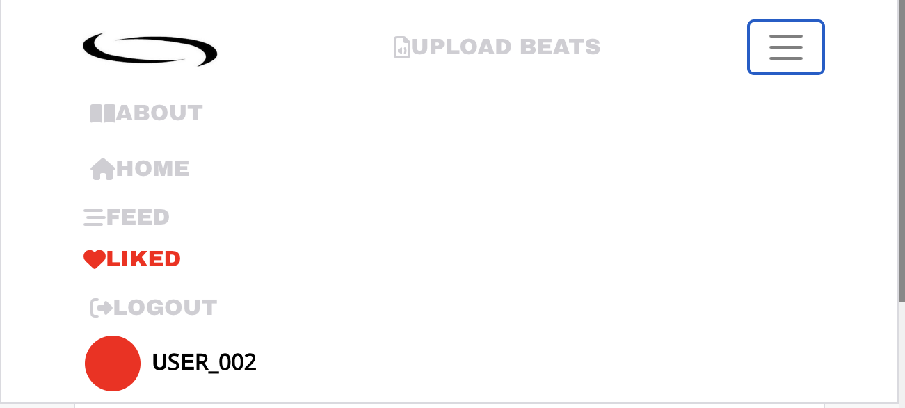

### Colour Scheme:

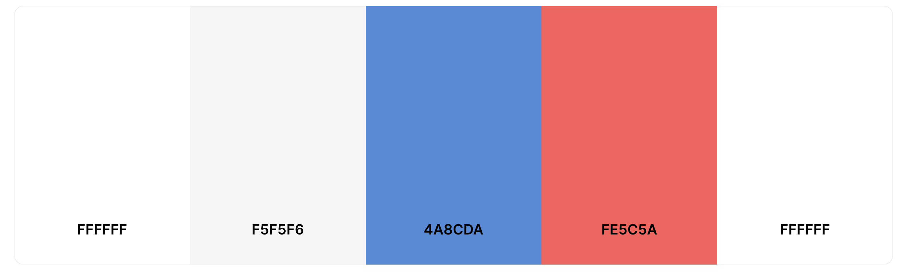

### Typography:

All fonts were obtained from the Google Fonts library. I chose the following fonts for the page:

1. Noto, for the majority of the site
2. Archivo Black for the Navbar
3. Kanit , but rarely.

## Features

### Existing Features:

#### Header:


##### URl Tab

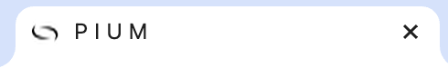

##### Navigation - Desktop:


##### Navigation - Mobile:


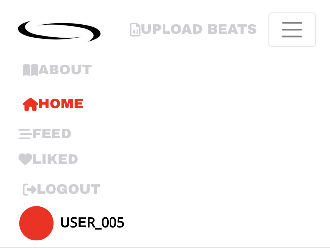

#### About Page:

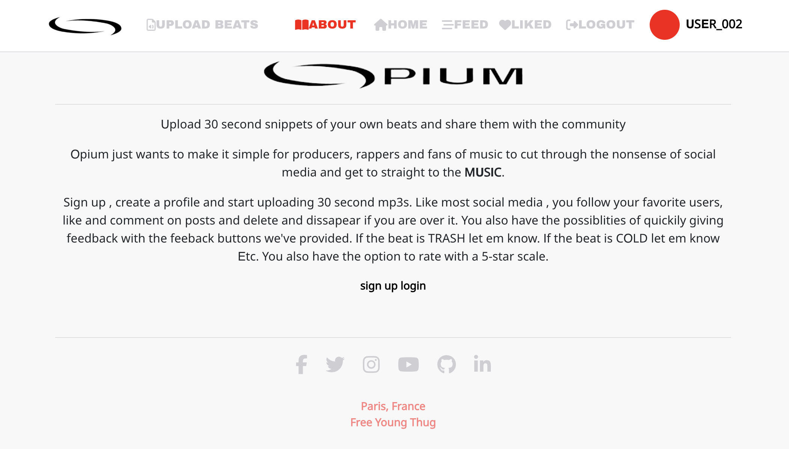

#### Feedback form (buttons):

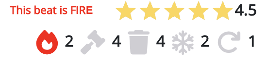
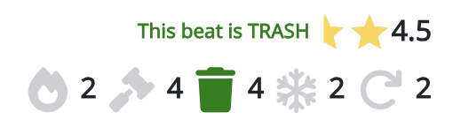

#### Star Rating :

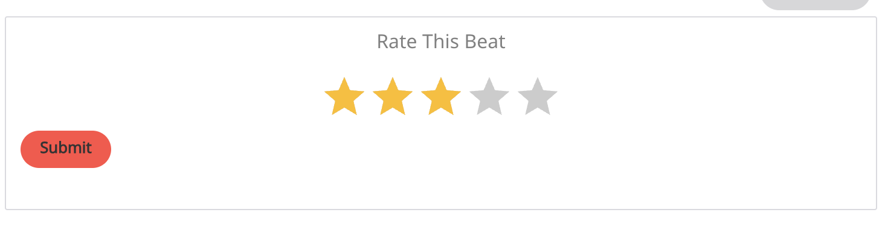
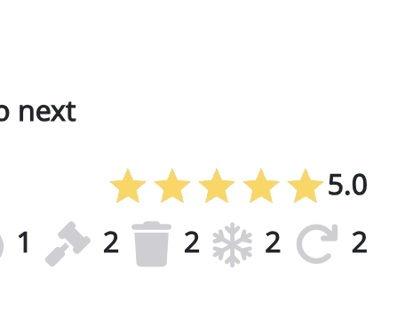

#### 404 Page Not Found:

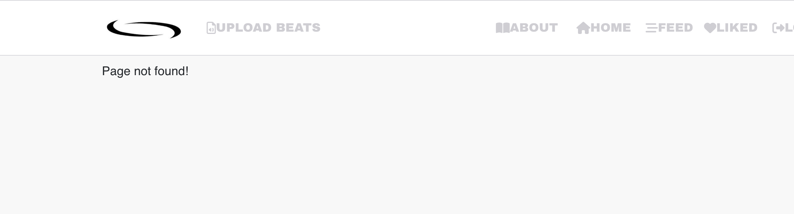

#### Popular Profiles:


#### Social Links:

###### \*at the bottm of the about page

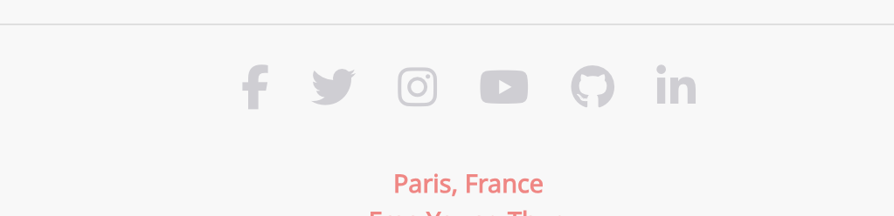

#### Log in, Log out & Sign up:

##### Login:

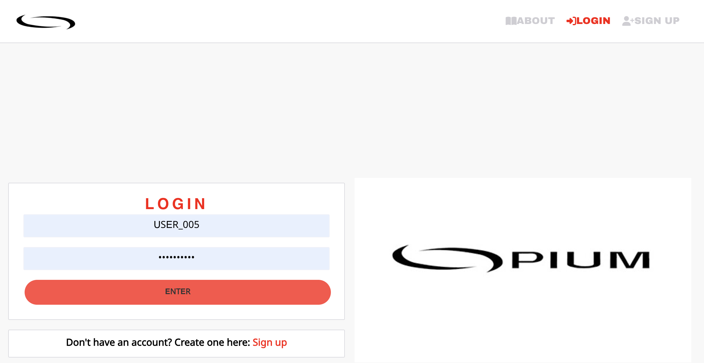

##### Logout:

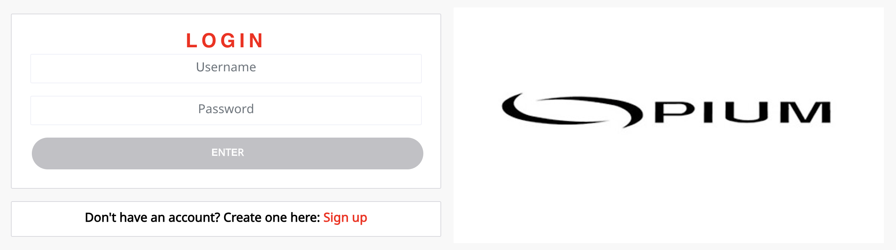

##### Sign-up:

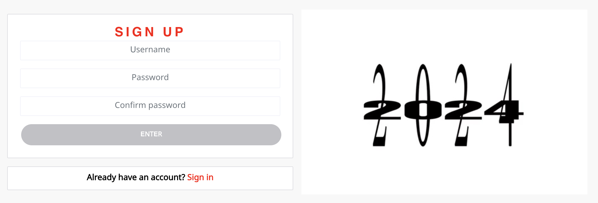

##### 404 Page NOT FOUND:

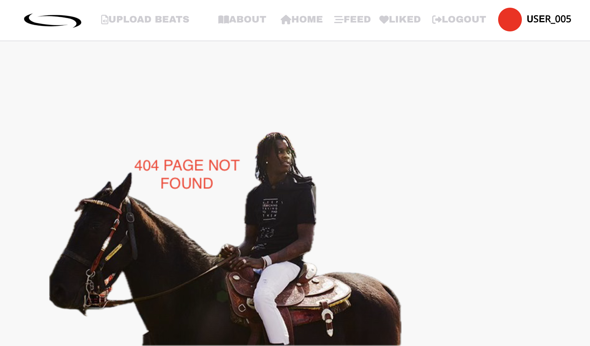

### Features Left to Implement:

- In app remixing ( I want the user to be able to slow down speed up beats and add vocals)
- The ability see the best and worst beats ( beats with the most postive/negative feedback)
- In app bidding( users should be able to sell beats to other users)
- Notifications ( typical app notifcations ,new follwoer , new like , new comment etc, favorite users new posts).
- Some sort of private messaging , direct messages,maybe even group chats.
- Music wave when the beat starts playing .
- Longer MP3 uploads

## Testing

### Manual Testing:

##### \* There was an incredible amount of testing and this revealed several problems and gaps in my understanding.\*

1. Mp3 upload :

- Resolved by rewriting the whole.

2. 500 server error:

- Resolved with the aid of tutor support. All database migrations for both the Django project & apps needed to be cleared & remigrated. The precise steps for this have been documented in the README for the deployed backend API.

3. CRUD functionality has been tested for each of the following: Beats| Feedback buttons | Star rating | Comments | Likes | Follow | Profile

- Likes & Follow may only be created & deleted
- Profile can only be updated
- Ratings cannot be updated

4. All nav links open to the correct page.
5. All external links open to a new browser window.
6. Pages intended for logged-in users only will redirect logged-out users back to the home page.
7. Users attempting to edit content that they did not publish are redirected back to the home page.
8. Users are able to create a new account.
9. Users with an existing account are able to log in.
10. Each user has the ability to log out.

### Validator Testing

1. CSS files pass through the [Jigsaw validator](https://jigsaw.w3.org/css-validator/) with no problems.

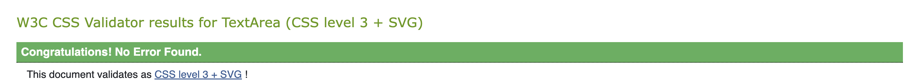

2. a. Javascript files pass through [ESLint](https://eslint.org/). The following issues were raised, and have been intentionally ignored as they are in relation to code that was provided in the Moments Walkthrough project:

- Props spreading is forbidden
- Do not pass children as props.
- Do not use Array index in keys
- 'a_name' is already declared in the upper scope
- Expected an assignment or function call and instead saw an expression
- Do not nest ternary expressions
- Fragments should contain more than one child

2. b. Additionally, this error has also been ignored:

- Identifier 'field_name' is not in camel case
- - relates to a database field in the API, case cannot be changed for this reason.

2. c. All instances of errors where a newline has been asked for within an opening & closing set of tags, eg:

- `<p>{owner} doesn't like the {drink}</p>` should be written as:

```
<p>
  {owner}
  {' '}
  doesn't like this
  {' '}
  {drink}
</p>
```

- This particular rule does not lend to the readability of the code, & instead hinders it (in my opinion).

2. d. All `console.log(err);` have been left in place & commented out, as it was suggested that this is also done in real-world scenarios.
3. e. Added all files affected by the above, unresolved warnings to `.eslintignore`, as well as added the following line to the top of each individual file, `/* eslint-disable */` to allow for a successful deployment on Heroku.

4. The page has an excellent Accessibility rating in Lighthouse:


4. Tested the site opens in Brave, Chrome, Safari & on a mobile device without issues.

5. All social links open to external pages as intended.

### Unfixed Bugs

1. I have not been able to get the NavBar to be as seemless as I would like.

2. When I started this project I wanted the user to be able to upload full songs ( mp3s up to 3 minutes at least ), I never figured out how to to do that.

3. THESE ARENT REALLY BUGS COME BACK TO THIS

## Technologies Used

### Main Languages Used

- HTML5
- CSS3
- Javascript
- Python
- SQL - Postgres

### Frameworks, Libraries & Programs Used

- Google Fonts : For all the fonts on the site.
- Font Awesome : For the icons.
- GitPod : To build the project & for the JSX & CSS files
- GitHub : To store the repository for submission.
- Am I Responsive? : To make sure the project legit on all devices.
- Favicon : For the logo image in the tab bar.
- Django : Used to build the backend database ( the API for the frontend)
- React-Bootstrap : For the layout of the website.
- ReactJS : To build the components for the frontend application.

## Components

Several components have been implemented within this project that have been reused throughout the project:

1. axiosDefault.js: Manages communication with the backend API.
2. Asset.js: Handles the loading spinner and user avatar display throughout the site.
3. DropdownMenu.js: Provides functionality for users to edit or delete their posts through a dropdown menu.
4. CurrentUserContext.js: Confirms the logged-in status of users to determine available functions.
5. ProfileDataContext.js: Manages the functionality related to following or unfollowing other users' profiles.
6. ToggleCollapse.js: Manages the toggling of collapsible elements.
7. useRedirect.js: Facilitates redirection of users to another page if they lack authorization to access the current page.
8. utils.js: Supplies functionality to components utilizing the Infinite Scroll feature.

#

##### These steps I got from this README doc: [Deployment steps](https://github.com/CluelessBiker/project5-red-crayon)

## Deployment

The site is deployed to Heroku.
The deployment steps:

1. Launch the gitpod.
2. Install ReactJS:

```
npx create-react-app . --use-npm
npm start
```

2. Then nstall all the following packages using the command `npm install`:

```
react-bootstrap@1.6.3 bootstrap@4.6.0
react-router-dom@5.3.0
axios
react-infinite-scroll-component
msw --save-dev
jwt-decode
-g eslint
```

3. Git add, commit,push changes to gitpod.
4. Create the app on Heroku, and then link the GitHub repository. You need to navigate to the 'Deploy' tab.

### Connect to the API:

1. Go to the Heroku app of the DRF-API, and under the Settings tab, add the following configvars:

- Key: CLIENT_ORIGIN | Value: https://react-app-name.herokuapp.com
- Key: CLIENT_ORIGIN_DEV | Value: https://gitpod-browser-link.ws-eu54.gitpod.io

2. Make sure that the trailing slash `\` at the end of both links has been removed, and then save the configvar pairs.
3. Install the Axios package, & create supporting `axiosDefaults.js`.

### Deploy to Heroku:

1. In the `scripts` section of `package.json` in gitpod, added the following command:

```
"heroku-prebuild": "npm install -g serve",
```

2. Add Procfile to project root & populate with the following:

```
web: serve -s build
```

3. Repeat the steps of git add/commit/push.
4. Deploy the project via the deploy button on Heroku.

## Credits

### Content

- [LAUREN MENTOR](https://github.com/CluelessBiker): I could not have wished for a better mentor.

### Media

- All images came from [Google images](https://www.google.com/)
