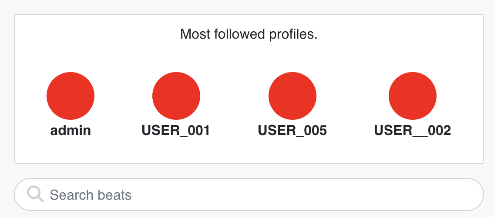
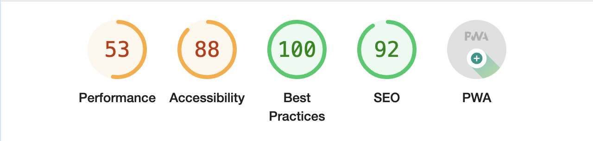
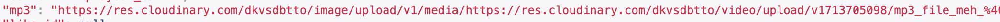
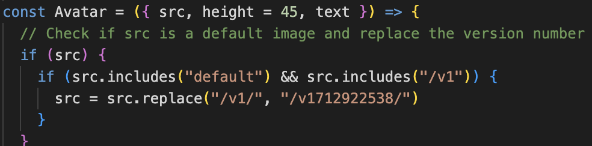

# OPIUM

Opium just wants to make it simple for producers, rappers and fans of music to cut through the nonsense of social media
and get to straight to the MUSIC.

- The repository for the DRF-API associated with this project can be found [HERE](https://github.com/BIBI78/drf_api). The installation, set up, and deployment steps are all found in this README doc.

#### DEPLOYED BACKEND API HEROKU [LINK](https://drfa-api-0c6557539d5a.herokuapp.com/)

#### DEPLOYED FRONTEND HEROKU [LINK - LIVE SITE](https://opium-a765be924d82.herokuapp.com/)

#### DEPLOYED BACKEND GITHUB [REPOSITORY](https://github.com/BIBI78/drf_api)


The live link for "OPIUM" [HERE](https://opium-a765be924d82.herokuapp.com/)

## Table of Contents

- [UX](#ux "UX")
  - [Site Purpose](#site-purpose "Site Purpose")
  - [Site Goal](#site-goal "Site Goal")
  - [Audience](#audience "Audience")
  - [Communication](#communication "Communication")
  - [Current User Goals](#current-user-goals "Current User Goals")
  - [New User Goals](#new-user-goals "New User Goals")
- [User Stories](#user-stories "User Stories")
- [Design](#design "Design")
  - [Colour Scheme](#colour-scheme "Colour Scheme")
  - [Typography](#typography "Typography")
  - [Imagery](#imagery "Imagery")
- [Features](#features "Features")
  - [Existing Features](#existing-features "Existing Features")
  - [C.R.U.D](#crud "C.R.U.D")
- [Testing](#testing "Testing")
  - [Validator Testing](#validator-testing "Validator Testing")
  - [Unfixed Bugs](#unfixed-bugs "Unfixed Bugs")
- [Technologies Used](#technologies-used "Technologies Used")
  - [Main Languages Used](#main-languages-used "Main Languages Used")
  - [Frameworks, Libraries & Programs Used](#frameworks-libraries-programs-used "Frameworks, Libraries & Programs Used")
- [Components](#oomponents "Components")
- [Deployment](#deployment "Deployment")
- [Credits](#credits "Credits")
  - [Content](#content "Content")
  - [Media](#media "Media")

## UX

### Site Purpose:

OPIUM is as a straightforward application designed for sharing music among users. Its objective is to facilitate the sharing of music(BEATS) with the world through a digital platform. The app aims to provide a space where users can receive feedback from peers.

Key features:

1. Music Sharing: Users can upload and share their favorite music tracks with their peers.
2. Peer Interaction: Users can interact with each other by listening to shared tracks and providing feedback or comments.
3. Feedback Mechanism: Opium includes features that enable users to give and receive feedback on shared beats,creating a collaborative and supportive community.
4. Opium aims to create a community-driven platform where music enthusiasts can connect, share their passion for music, and engage in meaningful interactions through feedback and comments.

### Site Goal:

The goal of OPIUM is to get people to share beats and give feedback and make connections.

### Audience:

Everyone who enjoys sharing music.
(Producers,fans, rapopers, the curious, anyone)

### Communication:

The communication style of Opium revolves around simplicity.Its all about the music and feedback.

### Current User Goals:

The goal is to build a new community that is all about sharing/making/talking about music. The focus is

1. Community Engagement
2. Content Contribution
3. Feedback and Improvement

### New User Goals:

The user shouldnt be mindlessly scrolling but listeing to all the beats and reacting.

1. Active Engagement: users should immerse themselves and listening to beats, while interacting with the app.
2. Participation: Users shouldnt be shy. They are emcouraged to participate in feedback and ratings.

### Future Goals:

1. Provide more ways for the user to intereact with the app:

- Enable users to remix beats directly within the app, allowing for creative reinterpretations and collaborations aka REMIXES

- Implement a feature for users to record and upload their own vocals or rap verses over beats.

2. Messaging Functionality:

- Introduce a messaging feature.
- Direct messaging , Group chats, etc.

3. Monetization Opportunities:

- Develop a marketplace feature where users can sell their beats and offer music-related services such as mixing, mastering, or custom production.
- Implement secure payment processing and transaction management.

## User Stories

Here are the links to the [GitHub Issues](https://github.com/BIBI78/v1/issues) for this project.

## Design

##### Site Navigation:


### Colour Scheme:


### Typography:

All fonts were obtained from the Google Fonts library. I chose the following fonts for the page:

1. Noto, for the majority of the site
2. Archivo Black for the Navbar
3. Kanit , but rarely.

## Features

### Existing Features:

#### Header:


##### URl Tab


##### Navigation - Desktop:


##### Navigation - Mobile:


#### About Page:


#### Feedback form (buttons):


#### Star Rating :


#### 404 Page Not Found:


#### Popular Profiles:



#### Social Links:

###### \*at the bottm of the about page


#### Log in, Log out & Sign up:

##### Login:


##### Logout:


##### Sign-up:


##### 404 Page NOT FOUND:


### Features Left to Implement:

1. In-App Remixing:

- Enable users to manipulate beats directly within the app, allowing them to adjust tempo, pitch, and other parameters.
- Tools for users to overlay vocals or other audio elements onto existing beats,creative remixing and mashup creation.

2. Beat Ranking:

- Implement a ranking system that highlights the best and worst beats based on user feedback. This could involve "aggregating" feedback data such as likes, comments, and ratings to identify the most positively or negatively rated/received beats.

3. In-App Bidding:

- Introduce a feature that enables users to buy and sell beats directly within the app through a bidding system. Users can list their beats for sale, specify starting prices and bidding durations, and engage in bidding wars with other users. This functionality can facilitate a vibrant marketplace within the app and provide opportunities for users to monetize their musical creations.

4. Notifications:

- Implement a notification system to keep users informed about relevant activities within the app. Notifications could include alerts for new followers, likes, comments, and beats from favorite users.

5. Private Messaging:

- Introduce private messaging functionality that allows users to communicate directly with each other.

6. Music Wave Visualization:

- JSX WAVE VISUALIZER

7. Extended MP3 Uploads:

- Increase the maximum duration for MP3 uploads to accommodate longer tracks and compositions and whatever else.

## Testing

### Manual Testing:

##### \* There was an incredible amount of testing and this revealed several problems and gaps in my understanding.\*

1. Mp3 upload : At the beginning, I had to conduct extensive testing on the MP3 upload process. I encountered numerous problems and errors in the console, prompting me to repeatedly test and retest uploading the files until I eventually found a satisfactory solution. It was definitly trickier than I initially expected.

1. CRUD functionality has been tested for each of the following: Beats| Feedback buttons | Star rating | Comments | Likes | Follow | Profiles

1. Beats:

- Tested creation, retrieval, updating, and deletion of beats.
- Ensured all operations function as expected.

2. Feedback Buttons:

- Tested functionality of feedback buttons (e.g., fire, cold, hard, trash, loop) to ensure they trigger the intended actions and update beat feedback appropriately.

3. Star Rating:

- Tested the star rating feature to ensure users can rate beats accurately and that ratings are reflected correctly.

4. Comments:

- Verified the ability to add, view, edit, and delete comments on beats.

5. Likes:

- Tested liking and unliking beats to ensure likes are recorded and reflected accurately.

4. Follow:

- Tested the follow functionality to verify users can follow/unfollow each other successfully.

6. Profiles:

- Ensured profile creation, updating, and viewing functionality works correctly, including profile picture upload and bio editing.

### Additional Testing :

1. The correct page opens for all navigation links.
2. External links open in a new browser window.
3. Logged-out users attempting to access pages for logged-in users are redirected to the home page.
4. Users trying to edit content they didn't publish are redirected to the home page.
5. Creating a new account is possible for users.
6. Existing account holders can log in.
7. Every user has the option to log out.

### Validator Testing

1. CSS files pass through the [Jigsaw validator](https://jigsaw.w3.org/css-validator/) with no problems.


2.ESLint validates your code as you work. If an error is encountered, the app will not compile. This is the fundamental role of ESLint. Es Linter checks out with no errors. [ESLint](https://eslint.org/).

3. The lighthouse score couldnt be helped because the mp3 files are huge.
   

### Unfixed Bugs

1. I had a nightmare writing the MP3 app part of this project. I went through maybe five different iterations of the code. I tried fixing the first three attempts, but bugs kept appearing out of nowhere. I couldn't give up on it though; I had no other ideas I felt passionate about, and I didn't want to turn in something lame that I couldn't show my friends. So, I deleted everything and tried again, but that attempt failed. Then I rewrote it once more, and somehow it came together, albeit with a few bugs. I encountered difficulties uploading the MP3s to Cloudinary, and once that was accomplished, it was challenging to obtain the appropriate Cloudinary link for the frontend.The original MP3 link came with an unexpected double 'https' prefix: 
   which I could not remove.So I had to manually extract the link, create an 'mp3_url' variable to strip away the double prefix, and then integrate it into my code: 

2. I underestimated the fragility of this project. When I created a branch and began working there, a new path to Cloudinary was generated, causing my default images to stop working entirely. Initially, I decided to set this issue aside, assuming it wasn't a big deal.But this turned out to be a mistake. I later realized that this was actually a semi huge issue and had to invest considerable effort to resolve it. If felt like I had to part seas and move mountains just to get everything working again.  So this works for now but it is not optimal.

3. Getting all the apps and packages to work together was a little tricky. With the "Star-rating-react" package, I had to downgrade to an earlier version before deployment. Consequently, to get everything to work, I had to make ad hoc edits to the frontend logic of the code.

4. There was 401 authorization error that would appear in the console of my browser from time to time but it has not appeared lately and does not effect the functionality of the project.

## Technologies Used

### Main Languages Used

- HTML5
- CSS3
- Javascript
- Python
- SQL - Postgres

### Frameworks, Libraries & Programs Used

- Google Fonts : For all the fonts on the site.
- Font Awesome : For the icons.
- GitPod : To build the project & for the JSX & CSS files
- GitHub : To store the repository for submission.
- Am I Responsive? : To make sure the project legit on all devices.
- Favicon : For the logo image in the tab bar.
- Django : Used to build the backend database ( the API for the frontend)
- React-Bootstrap : For the layout of the website.
- ReactJS : To build the components for the frontend application.

## Components

### The components I used are :

1. Assets.js
2. Avatar.js
3. MoreDroptown.js
4. NavBar.js
5. NotFound.js

\*The only I reusded is the Asset.js

\*The rest are helper functions ,utlitly functions and hooks

6. axiosDefault.js
7. DropdownMenu.js
8. CurrentUserContext.js
9. ProfileDataContext.js
10. ToggleCollapse.js
11. useRedirect.js
12. utils.js

#

##### These steps I got from this README doc: [Deployment steps](https://github.com/CluelessBiker/project5-red-crayon)

## Deployment

The site is deployed to Heroku.
The deployment steps:

1. Launch the gitpod.
2. Install ReactJS:

```
npx create-react-app . --use-npm
npm start
```

2. Then install all the following packages using the command `npm install`:

```
react-bootstrap@1.6.3 bootstrap@4.6.0
react-router-dom@5.3.0
axios
react-infinite-scroll-component
msw --save-dev
jwt-decode
-g eslint
```

3. Git add, commit,push changes to gitpod.
4. Create the app on Heroku, and then link the GitHub repository. You need to navigate to the 'Deploy' tab.

### Connect to the API:

1. Go to the Heroku app of the DRF-API, and under the Settings tab, add the following configvars:

- Key: CLIENT_ORIGIN | Value: https://react-app-name.herokuapp.com
- Key: CLIENT_ORIGIN_DEV | Value: https://gitpod-browser-link.ws-eu54.gitpod.io

2. Make sure that the trailing slash `\` at the end of both links has been removed, and then save the configvar pairs.
3. Install the Axios package, & create supporting `axiosDefaults.js`.

### Deploy to Heroku:

1. In the `scripts` section of `package.json` in gitpod, added the following command:

```
"heroku-prebuild": "npm install -g serve",
```

2. Add Procfile to project root & populate with the following:

```
web: serve -s build
```

3. Repeat the steps of git add/commit/push.
4. Deploy the project via the deploy button on Heroku.

## Credits

### Content

- [LAUREN MENTOR](https://github.com/CluelessBiker) I could not have wished for a better mentor.

- The README doc outline for the frontend I got from [HERE](https://github.com/CluelessBiker/project5-red-crayon).

- The README doc outline for the backend I got from [HERE](https://github.com/CluelessBiker/project5-drf-api).

- The outline for the ratings app I got from [HERE](https://github.com/andreas-ka/explore-sthlm-react-frontend) .

- I used [ChatGPT](https://chat.openai.com/) To spell check and correct grammer throughout this project and to help add notes to the code.

### Media

- All images came from [Google images](https://www.google.com/)
